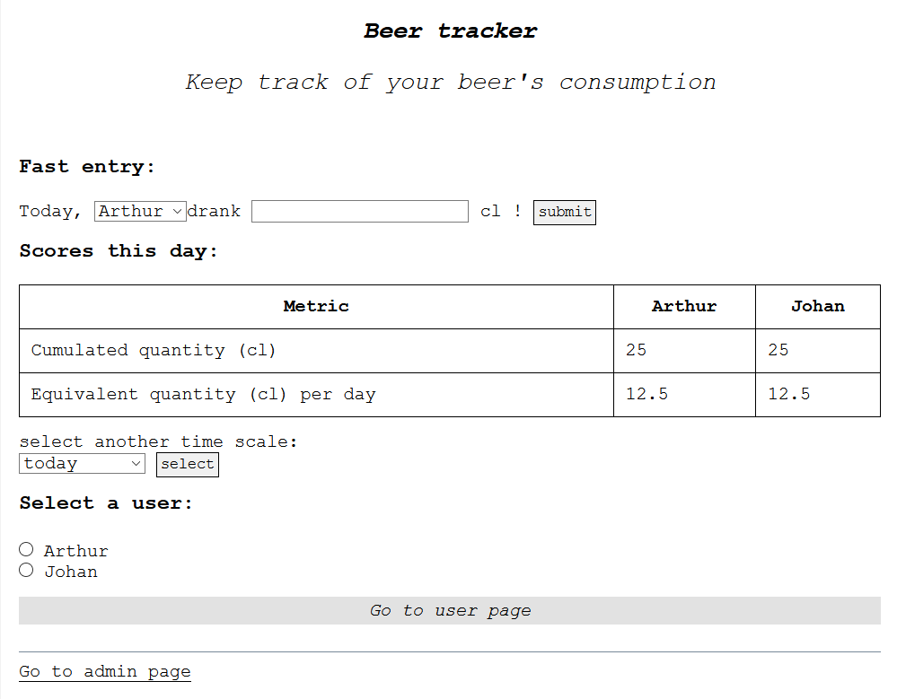
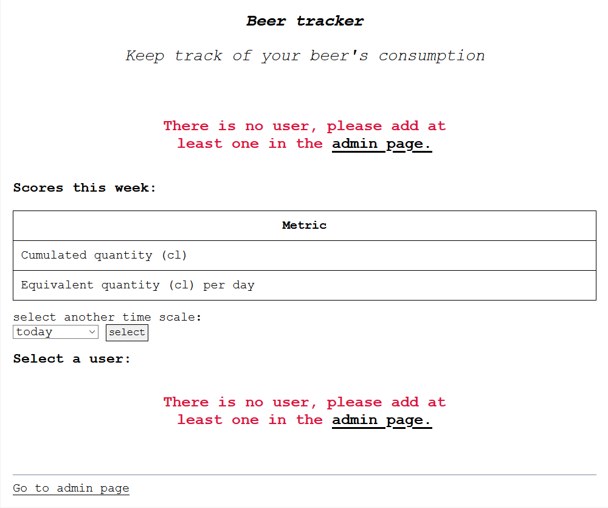
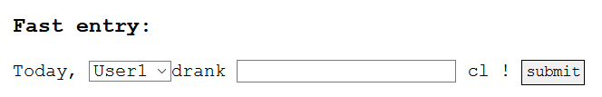
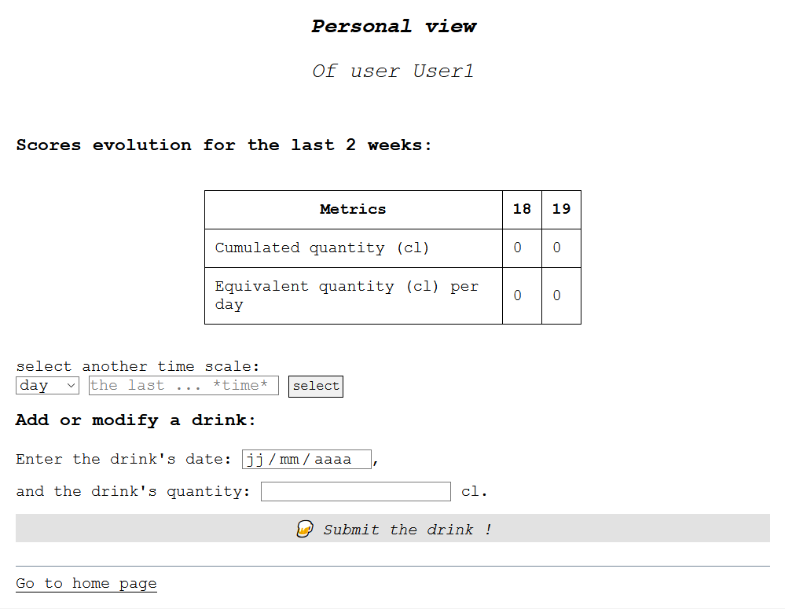

# Beer tracker

A *very* simple web app to track users' beer consumption.

## Install the app on your system

This app is designed to be used in a web server. However, you can use it localy with tools like [Wampserver](https://sourceforge.net/projects/wampserver/files/) on Windows.
After the tool is installed and launched, clone this repository on your app directory (for `Wampserver` users it would be something like `C:\wamp64\www\roommate-equalizer`) and search its adress with your favorite browser : `http://localhost/roommate-equalizer/index.php`.

## How to use the app

Firstly, the app needs at least one user to run correctly.

Then, one can see all user's consumptions during a given time unit, or navigate to a particular user's page.
One can also modify the time unit (week by default) to see consumption of:
* the current day,
* the current week,
* the current month,
* the current year.

If a user had a drink the current day, he can submit it without navigating to his page with this index in the top text input:

Note that if there are only one user, he will be selected as default user for the fast entry.

## The admin page

...allows one to add, modify or remove a user. A "reset" option is also possible to clear all database.

## The user page

Here the user can add or modify a drink on a given date. He can also visualize the evolution of his consumption on a chosen time scale (day, week, month, year) with a given offset (by default the last two weeks):

***Note that a new metric has been added: the cumulated mean over chosen time scale.***